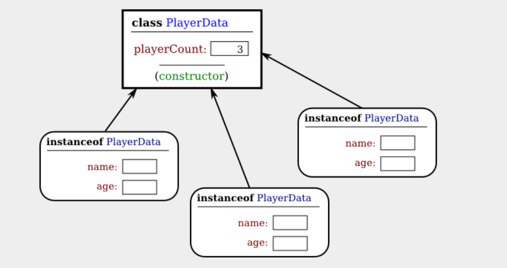
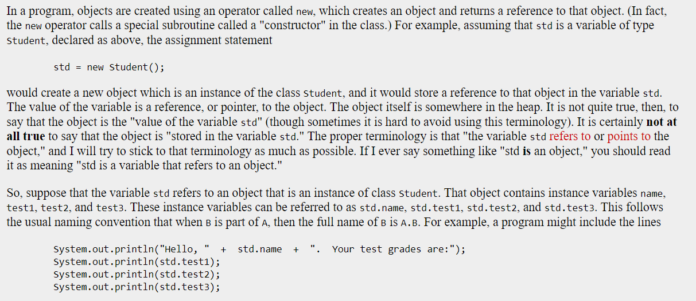

package ensf_409.week4;
//https://math.hws.edu/javanotes/c5/s1.html#:~:text=An%20object%20that%20is%20created%20using%20a%20class%20is%20said,contains%20are%20called%20instance%20methods.

public class copy_object {
     what is an object 
    // is an instance of a class(An object that is created using a class is said to be an instance of that class), object usually have name with nouns and behaviours, often verbs
    What is an object references ?
    holds refence to an object 

    it is more exact to say that classes are used to create objects. A class is a kind of factory—or blueprint—for constructing objects. 
    The non-static parts of the class specify, or describe, what variables and methods the objects will contain. 

    Objects are created and destroyed as the program runs, and there can be many objects with the same structure, if they are created using the same class.
    Consider a simple class whose job is to group together a few static member variables
    class UserData {
    static String name;
    static int age;
}In a program that uses this class, there is only one copy of each of the variables UserData.name and UserData.age. When the class is loaded into the computer, there is a section of memory devoted to the class, and that section of memory includes space for the values of the variables name and age. 
AS they are static they can be considered as a class variable so we can write it Classname.noun

Now, consider a similar class that includes some non-static variables:

class PlayerData {
   static int playerCount; (class variable)
   String name;(instance variable)
   int age;(instance variable)
}

playerData Student1 (this is object variable) this store the address of object. so it can be null
playerData Student1 = new StudentData(); this is an object storeed in heap

 playerCount is stored as part of the representation of the class in memory. Its full name is PlayerData.playerCount, and there is only one of it, which exists as long as the program runs.
 the other two variables in the class definition are non-static. There is no such variable as PlayerData.name or PlayerData.age, since non-static variables do not become part of the class itsel
 so we make objects an instance of PlayerData
 can be many objects created using the class, and each one will have its own variables called name and age.
 Every object gets its own copy of the non-static part of the class. 
 look here 

 that the static variable playerCount is part of the class, and there is only one copy. On the other hand, every object contains a name and an age. An object that is created from a class is called an instance of that class

 object are located in the heap as it dynamic so we can create new instances(objects) or delelte 
 
An object that is created using a class is said to be an instance of that class. We will sometimes say that the object belongs to the class. The variables that the object contains are called instance variables. The methods (that is, subroutines) that the object contains are called instance methods. For example, if the PlayerData class, as defined above, is used to create an object, then that object is an instance of the PlayerData class, and name and age are instance variables in the object

Static methods are part of the class; non-static, or instance, methods become part of objects created from the class. It's not literally true that each object contains its own copy of the actual compiled code for an instance method. But logically an instance method is part of the object, and I will continue to say that the object "contains" the instance method.

 you should distinguish between the source code for the class, and the class itself (in memory).
 source code determines both the class and the objects that are created from that class
 static" definitions in the source code specify the things that are part of the class itself (in the computer's memory), 
 
  non-static definitions in the source code specify things that will become part of every instance object that is created from the class. 
  

   a class is a type, similar to the built-in types such as int and boolean. So, a class name can be used to specify the type of a variable in a declaration statement, or the type of a formal parameter, or the return type of a function. For example, a program could define a variable named std of type Student with the statement

Student std;
However, declaring a variable does not create an object! This is an important point, which is related to this Very Important Fact:

In Java, no variable can ever hold an object.
A variable can only hold a reference to an object.

Instead of holding an object itself, a variable holds the information necessary to find the object in memory. This information is called a reference or pointer to the object. In effect, a reference to an object is the address of the memory location where the object is stored. When you use a variable of object type, the computer uses the reference in the variable to find the actual object.

Talk about how object variable hold refence to the object and how an instance variable of an object can be access using object variable.

Call by Value vs Object Reference
This is mainly for methord so if I use call by value I will sent a copy of my arguments (this is data when I call my function MA) to the parameterof my function(where I define the datatype of arugemnts PF)

object reference is when I sent a reference Or an address to my parameter as my arguments.

Shallow copy of 
String a = "hahaha" where a points to "hahaha" in the string pool
String b = a; this means I just did a shallow copy  b also points to same "hhaha" in the string pool as a 
So if I change b = "bad Copy" then a will also be impacted by

For object that is created
Copies all primitive datatype values 
copies object refence types 
New refenece variable will point to orginal values
Changing the new object will a;so change the original object

deep copy 
THis is where we crate a new object that use new to make it own "hahaha" they are not pointing at the same loaction 
Copies all primitive and non primitive datatype 
copy is indepent of the orginal but it cost memory

    

