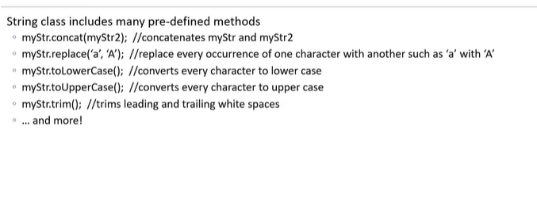

CRT + alt +v is for paste 
Crtl + shift+v is preview

Unicode : Standard encoding using hexadecimal string
static:
• Can be applied to variables, methods, blocks, and nested classes
Member belongs to its own type- one instance that is shared
Memory efficient
final:
• Can be applied to variables, methods, and classes
• Prevents variable values from being changed
• Prevents methods from being overridden
Prevents classes from being extended

Strings
String is not a premitive data type it a in bult class bulit by java
String are immutable mean cant change fixed lenght read only. 
but we can reassign the String object 
String can be implicitly assigned "" and explicitly define with new String 
String pool in heap  is used to contain all the string values 
This store a single copy of a literal string 
however to make more copy of a literal need to use the keyword "new" this will make a new block so if we use the compareson opertator we will get false if (str1 == str3) even though content are same.
Manipulate string pool sound interesting 

 
This image take about the inbult string constructor. 
-To make empty string,string,string eith obj,string with array,string with select array,bytearray , select bytearray

  and  Methrod of string 

String casting 
Primitive datatype to String type
String.valueOf(other data type)

Cast a string to primitiva datatype string

Interger.parselnt(String mystring)

new Float(String myStr).floatValue()

new Double(String myStr).doubleValue()

Creating substring
obj.substring(start,end) 
obj.substring(start) // this will print to the end of literal 

Compareing 
comapre objects == 
compare content obj.equal(obj2)
compare indexs interm of Alpabatical order so return -1 , 1, 0

StringBuilder Class 

Objects that allow text to be modified (mutable)
Variable-length sequence of characters with a designated capacity
Use String unless StringBuilder offers an advantage
 • e.g. concatenating several strings together
Methods for appending, inserting, and deleting

Constructor  
obj1.apprend("jflasfja") append at the end of the text string
obj2.inset(4,"kfjaf") insert in the fourth index

Regular expression  
USed for  pattern matching and string matching 
[abc] this means any characters a or b or c
[^abc] any charters except a or b or c
More  
Quantifiers  used to specify how many time a expression can occur.
Regex metaCharaters 
  and  
more  and 

eg: Mobile number start with 403 or 971  and has 7 digits 
[403,971] \d{7}
first charter, uppercase, contain lower case ,only one degit allowed between then eg:Abcd3efg
^[A-Z][a-z]*[0-9]{1}[a-z]*$   // $ means end of line

Uses java.util.regex package
Creates a search pattern for matching

Pattern class defines the search pattern
  Pattern.compile()
 • Flags are used to modify the search parameters (e.g. case sensitivity, ignore special characters, etc.)

Matcher class is used to search for the pattern match
Specified through expressions, metacharacters, and quantifiers

How to do precision, witdth in formatted string 
