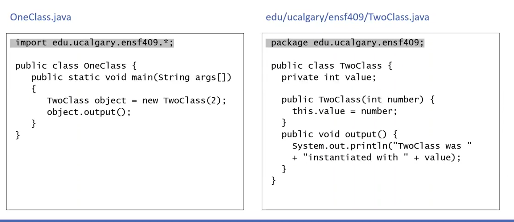

If I wanted to make a class (callled one.java) and what to reuse some functions that I made in this class
I will import it in my new class( called it two.java) (modulation)
How to do this ?
Step1) In one.java write package folders with ".";
Step 2) In two.java write import folder.folder.one.java;

Very important this show how to compile a package

adv to packages
reusuabily 
Organization
Avoid name conflicts
